# WEB课程设计：二手物品交易系统

## 需求分析

- 用户的注册、登录及个人信息的修改；
- 跳蚤市场商品信息的浏览，本系统中所有商品的多种查询功能；
- 跳蚤市场商品的发布、对已发布商品状态和信息的修改和删除；
- 用户购物车功能，可以对购物车中的商品进行管理；
- 与其他用户进行交易，对交易状态的管理；
  - 购买其他用户的上架商品
  - 用户个人订单状态：未发货、正在路上、已确认收货、已评价 4 种
  - 在交易完成后可以对卖家做出信用评价

根据课程设计选题的业务情况，该系统功分成游客、注册用户，这两种用户的对应权限如下：

- 游客：浏览商品信息、搜索查看商品信息；
  - 注册 => 登录 => 注册用户，解锁用户权限
- 注册用户：
  - 浏览商品信息
    - 搜索商品信息
      - 模糊查询
      - 分类查询
    - 查看商品对应的卖家信息
  - 出售商品
    - 发布商品
    - 编辑已发布的商品，调整商品状态
    - 删除自己发布的商品
  - 购买其他用户发布的商品
    - 取消订单
    - 卖家已发货则无法取消，确认收货后钱进入对方账户
    - 对卖家进行信用评价
  - 对个人账户信息的修改
    - 修改个人信息
    - 账户充值
    - 修改密码
  - 个人购物车管理
    - 把其他用户发布的商品加入到购物车中
    - 删除购物车中的商品
    - 在购物车中直接付款购买商品

### 框架选择

- 前端：Vue + Element UI
- 后端：Spring Boot + Spring  JPA 
- 数据库：MySQL
- 采用RESTful架构，前后端分离

## 踩坑与爬坑之路

- [Spring JPA 自定义本地查询返回实体类](./log\JPA自定义本地查询)
- [Vue DOM绑定数组元素](./log\vue绑定数组元素)
- emmm因为坑太多，而且要复习，好多后来自己改好之后没有时间整理了。。

## 部分图片展示

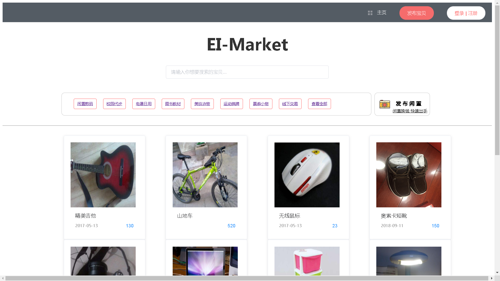

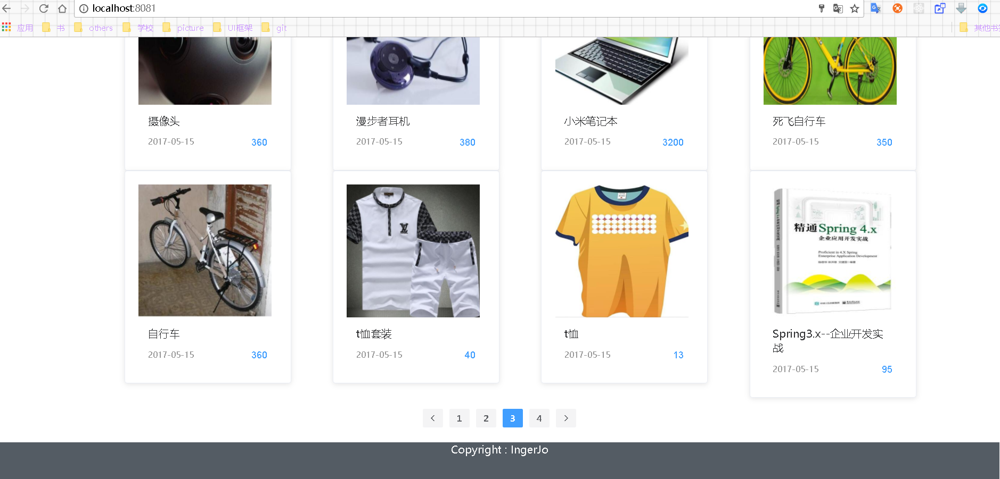

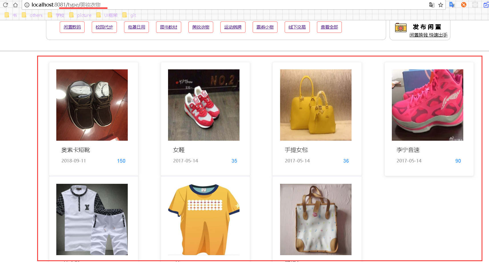

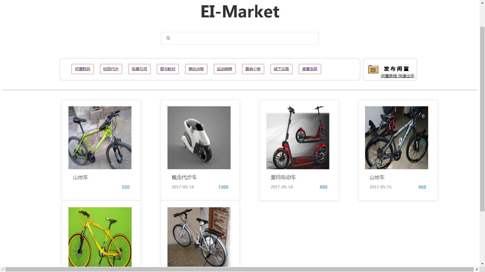

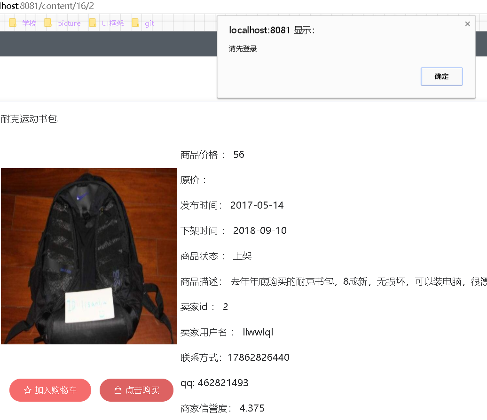

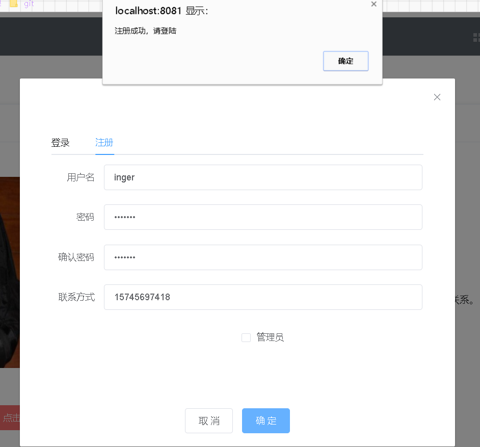

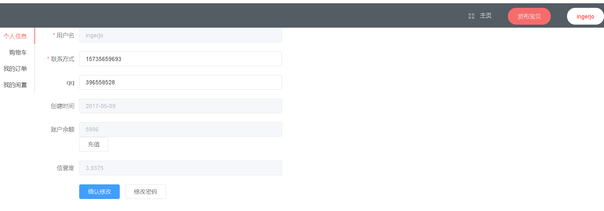

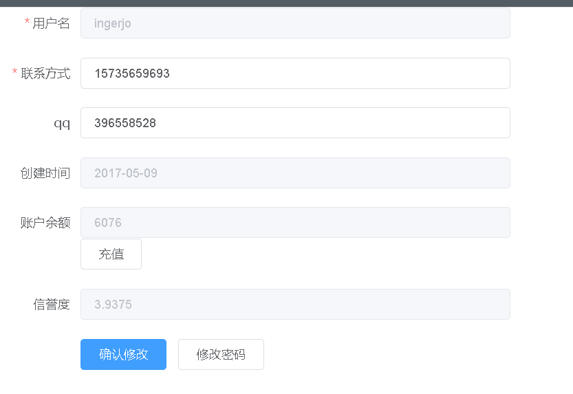

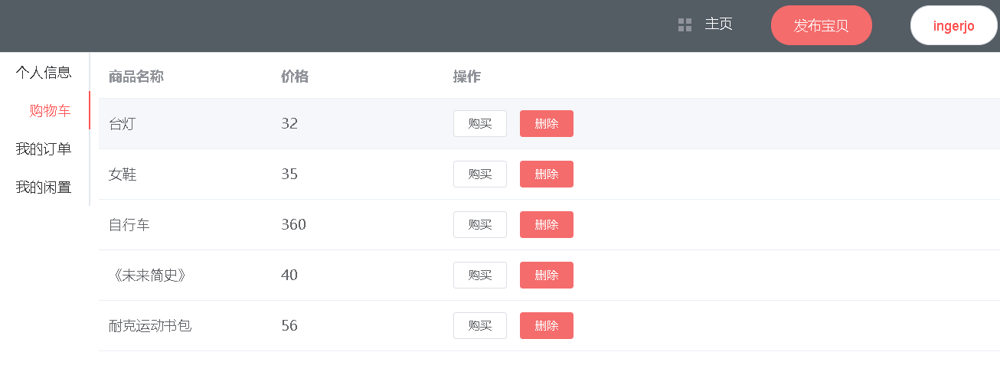

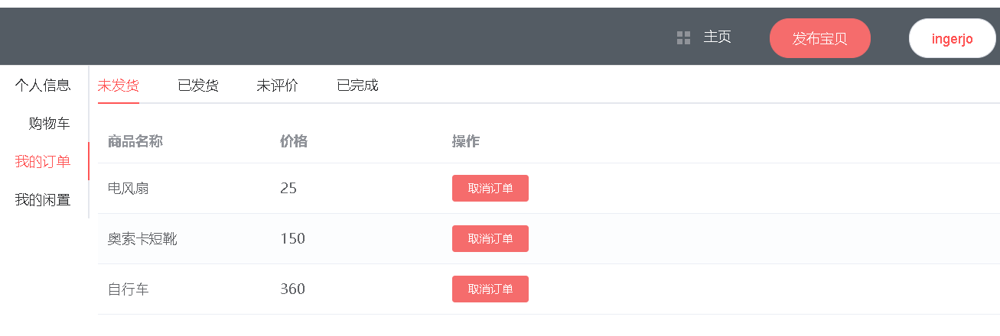

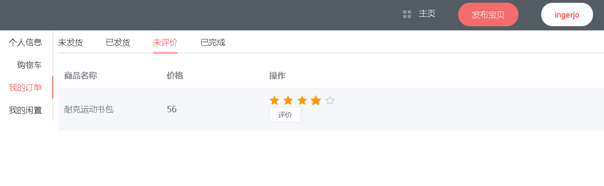

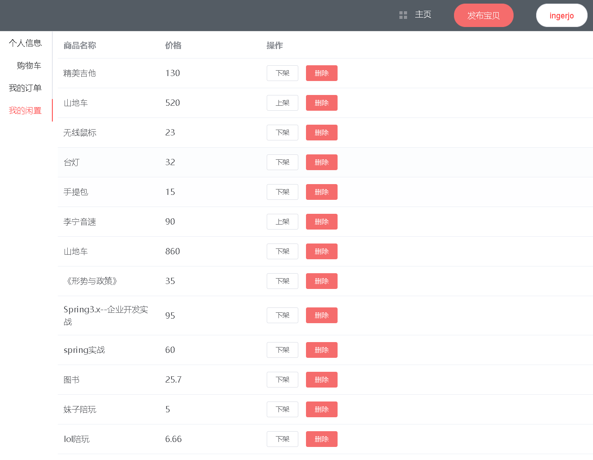

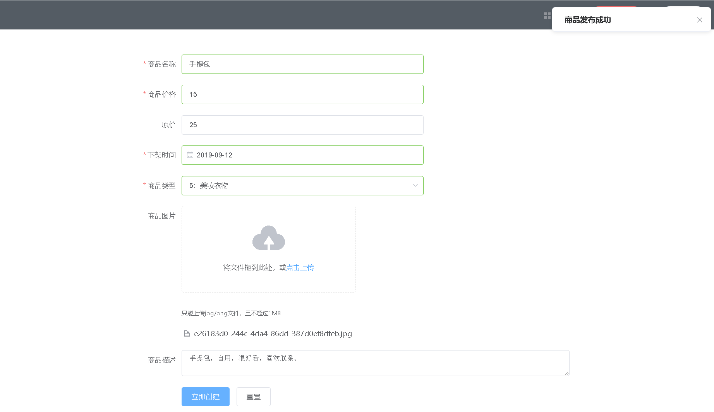

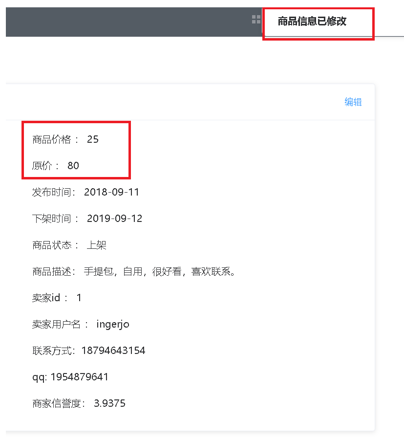

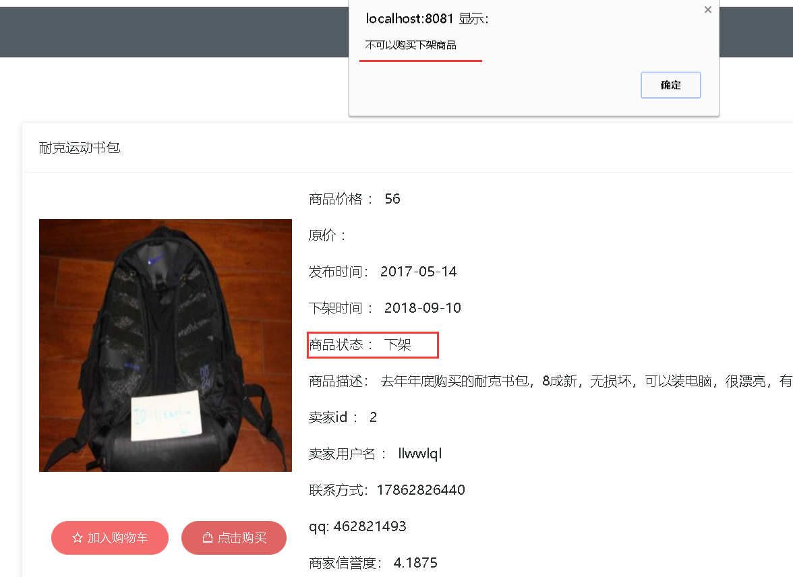

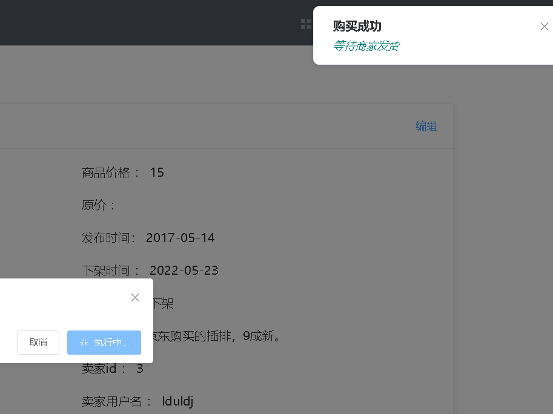

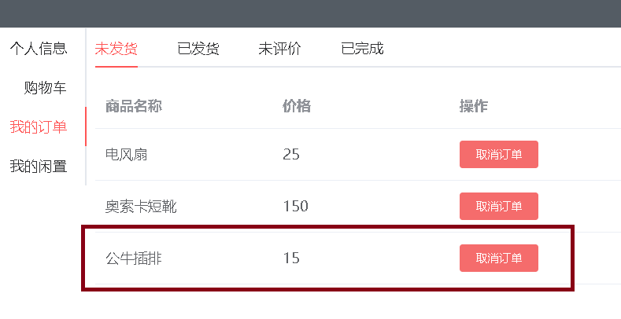