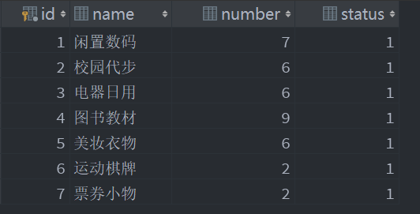
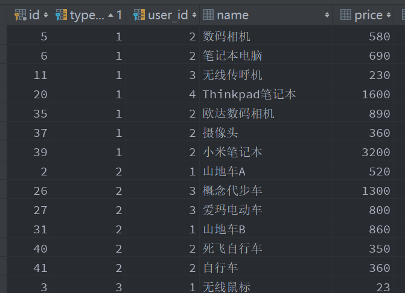
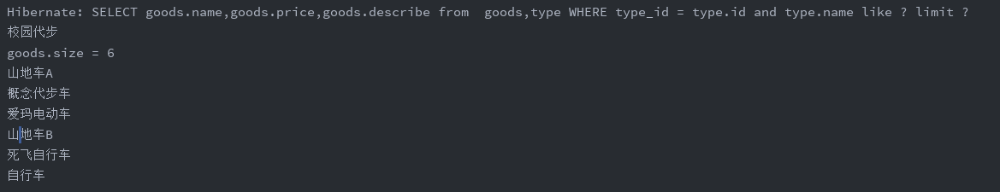
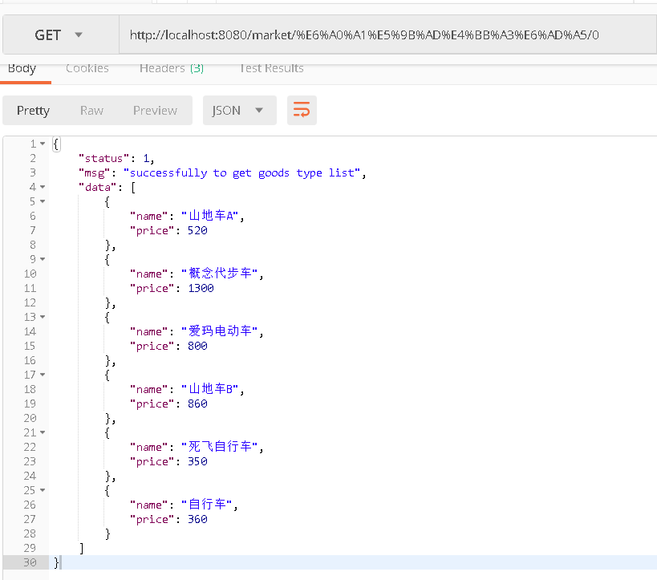

## JPA自定义本地多表查询返回实体类

- 实体类：商品 Goods 类和分类 Type 类
- 实现效果：获取当前类别下的所有商品的标题、价格、描述
- IDE: IDEA
- 数据库：mysql

所谓本地查询，就是使用原生的sql语句（根据数据库的不同，在sql的语法或结构方面可能有所区别）进行查询数据库的操作。我采用的是直接在 MySQL 中建立数据库并添加相关数据，所以在实体类中只是把每列的属性定义了一下。yml采用的也是 update 方式。

```groovy
# application.yml文件数据库相关代码
spring:
  jpa:
    hibernate:
      ddl-auto: update
    show-sql: true
  jackson:
    default-property-inclusion: non_null
  datasource:
      driver-class-name: com.mysql.jdbc.Driver
      url: jdbc:mysql://localhost:3306/market
      username: root
      password: ****** # 这里是你自己的数据库密码
```

以下是 Type 和 Goods 两张表的建表内容

```sql
CREATE TABLE goods
(
  id          INT AUTO_INCREMENT
  COMMENT '商品主键'
    PRIMARY KEY,
  type_id     INT          NULL
  COMMENT '商品分类，外键',
  user_id     INT          NULL
  COMMENT '用户外键',
  name        VARCHAR(50)  NULL
  COMMENT '商品名称',
  price       FLOAT(11, 2) NULL
  COMMENT '出售价格',
  real_price  FLOAT(11, 2) NULL
  COMMENT '真实价格',
  start_time  VARCHAR(25)  NULL
  COMMENT '发布时间',
  polish_time VARCHAR(30)  NULL
  COMMENT '擦亮时间，按该时间进行查询，精确到时分秒',
  end_time    VARCHAR(25)  NULL
  COMMENT '下架时间',
  `describe`  TEXT         NULL,
  comment_num INT          NULL
  COMMENT '评论回复数量',
  CONSTRAINT goods_type_foreign
  FOREIGN KEY (type_id) REFERENCES type (id),
  CONSTRAINT goods_user_foreign
  FOREIGN KEY (user_id) REFERENCES user (id)
)
  ENGINE = InnoDB;
```

```sql
CREATE TABLE type
(
  id     INT AUTO_INCREMENT
  COMMENT '主键'
    PRIMARY KEY,
  name   VARCHAR(30)             NULL
  COMMENT '分类名',
  number INT DEFAULT '0'         NULL
  COMMENT '该分类下的商品数量',
  status TINYINT(10) DEFAULT '0' NULL
  COMMENT '分类状态，0正常，1暂用'
)
  ENGINE = InnoDB;
```





#### 1. 分别编写 Type 和 Goods 的实体类自动生成Getter  and Setter

```java
// 此处省略了 Getter and Setter 及构造方法
@Entity 
public class Type {

    @JsonIgnore
    @Id
    @GeneratedValue
    private Integer id;

    @Column(unique = true)
    private String name;

    private Integer number;

    @OneToMany(mappedBy = "type")
    private Set<Goods> goods;
}
```

```java
// 此处省略了 Getter and Setter 及构造方法
@Entity
public class Goods {

    @Id
    @GeneratedValue
    private Integer id;

    @ManyToOne
    @JoinColumn(name = "type_id",columnDefinition = "Integer")
    private Type type;

    @Column(name = "user_id")
    private Integer userId;

    @Column(name = "name")
    private String name; //商品名

    @Column(name = "price")
    private float price; //价格

    @JsonIgnore
    @Column(name = "real_price")
    private float realPrice; //原价

    @Column(name = "start_time")
    private String startTime;

    @Column(name = "end_time")
    private String endTime;

    @Column(name = "polish_time")
    private String polishTime;

    @Column(name = "comment_num")
    private Integer commentNum;

    @Column(name = "describe",columnDefinition = "text")
    private String describe;
}
```

另外，JPA 无法完成查询结果到实体类的映射，所以需要一个 ResultUtil 类将数据元素转为实体类。以下是我的 ResultUtil 类源码：

```java
public class ResultUtil {
    public static <T> Result<T> success(ResultEnum resultEnum, T resultData) {
        Result<T> result = new Result<>();
        result.setStatus(resultEnum.getStatus());
        result.setMsg(resultEnum.getMsg());
        result.setData(resultData);
        return result;
    }

    public static Result success(ResultEnum resultEnum) {
        return success(resultEnum, null);
    }

    public static Result error(ResultEnum resultEnum) {
        Result result = new Result();
        result.setStatus(resultEnum.getStatus());
        result.setMsg(resultEnum.getMsg());
        return result;
    }

    public static Result error(Integer status, String message) {
        Result result = new Result();
        result.setStatus(status);
        result.setMsg(message);
        return result;
    }
}
```


#### 2. 继承 JpaRepository接口 ，并在其中定义自己想要实现的方法

因为spring-data-jpa提供基础的CRUD工作，同时也提供业务逻辑的功能，所以我们的Repository接口要做两项工作，继承spring-data-jpa提供的基础CRUD功能的接口，然后在 TypeRepository 这个接口中定义自己的方法。

```java
public interface TypeRepository extends JpaRepository<Type, Integer> {

    @Query(nativeQuery = true)
    List<Goods> findGoods(@Param("typeName") String Type, Pageable pageable);

}
```


`@Query `注解表示这是一个查询方法，nativeQuery 值设置为ture，使用`@Param` 注解注入参数。

```java
//Query 注解源码
@Retention(RetentionPolicy.RUNTIME)
@Target({ElementType.METHOD, ElementType.ANNOTATION_TYPE})
@QueryAnnotation
@Documented
public @interface Query {
    String value() default ""; //用来定义原生sql语句

    String countQuery() default ""; 

    String countProjection() default "";

    boolean nativeQuery() default false; //本地查询，默认值为 false，当为 true 是会调用你定义的 sql 语句查询

    String name() default "";

    String countName() default "";
}
```

然后在 Type 实体类中定义查询语句

```java
//定义本地查询结果集的映射方式
@SqlResultSetMapping(
        name = "GoodsSimpleInfo",
        classes = {
                @ConstructorResult(
                        targetClass = Goods.class,
                        columns = {
                                @ColumnResult(name = "name", type = String.class),
                                @ColumnResult(name = "price", type = Float.class),
                                @ColumnResult(name = "describe", type = String.class),
                        }
                )
        }
)
@NamedNativeQuery(
    //定义本地查询名字，表明是 Type 对象的 findGoods 方法
        name = "Type.findGoods",
    //query 语句中的为原生 sql 语句，建议可以先在数据库中验证是否可行然后直接
        query = "SELECT goods.name,goods.price,goods.describe " +
        "from  goods,type " +
        "WHERE type_id = type.id and type.name like :typeName",
    //上面定义的接收结果的映射集
        resultSetMapping = "GoodsSimpleInfo"
)
@JsonSerialize(using = TypeSerialize.class)
public class Type {
	//...
}
```

默认情况下，JPA假设原生sql查询中select语句将会返回一个实体类型， 包含与返回的实体的所有字段或属性相对应的所有列，即列名和实体属性/字段名一样。我这里只需要返回 Goods 的三个属性即可。

#### 3.在 Controller 中调用

```java
@RestController
public class TypeController {

    @Autowired
    private TypeRepository typeRepository;

    @GetMapping("/{type}/{page}")
    public Result<List<Goods>> getGoodsListByType(@PathVariable("type") String type,
                                                  @PathVariable("page") int page) {
        List<Goods> goods = typeRepository.findGoods(type, PageRequest.of(page,12));
/*        System.out.println(type);
        System.out.println("goods.size = " + goods.size());
        if (goods.isEmpty()){
            System.out.println("empty");
        }else{
            for (Goods i: goods
                 ) {
                System.out.println(i.getName());
            }
        }*/
        return ResultUtil.success(ResultEnum.GET_GOODS_TYPE_LIST, goods);
    }
}
```

使用 List 集合接收结果，注释掉的为测试代码。测试时，**Page 下标是从 0 开始的**，一定要在 url 中输入 0 数据才会从头展示，如果在第 0 页已经展示完所有的结果后，在第 1 页会显示 null 但是是查询成功，这个时候就会很容易被误导以为是 sql 语句出了问题。解决方法可以在前端部分获取地址栏的 url 后传过来 page-- 的参数值（前端部分我还没有写）。

#### 4. 测试结果





--------------------

参考文章：[Query Annotation in Spring Data JPA](https://www.tuicool.com/articles/jQJBNv)、[JPA native query](https://blog.csdn.net/jjjjyyyyy/article/details/4562331) 