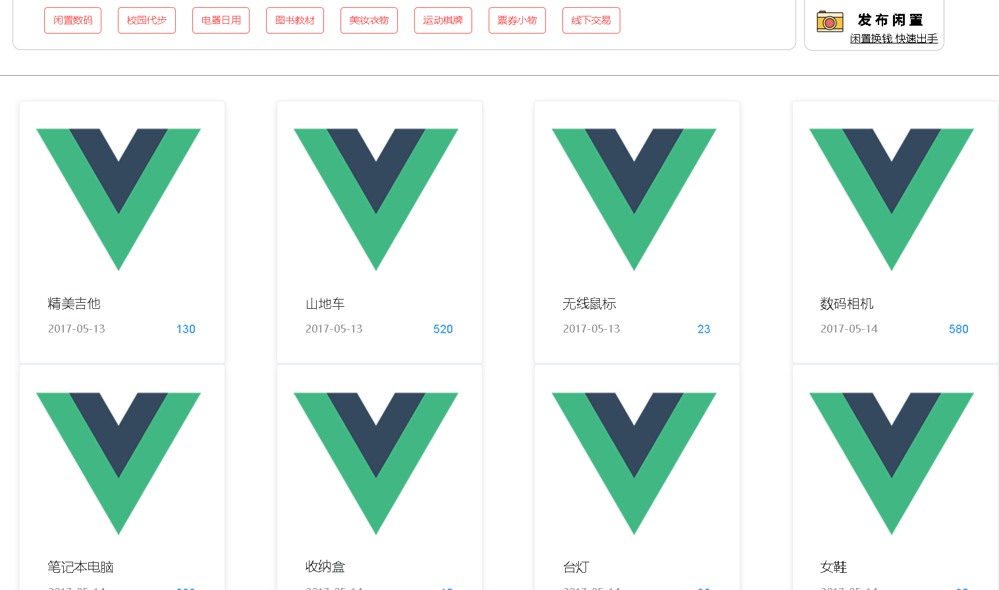

## Vue 使用 V-model 绑定数组元素[MVVM + 生命周期函数部分解析]

- 实现功能：展示从后台获取的 Goods 列表数据
- 使用框架：Axios、ElementUI



众所周知，Vue 是 MVVM 架构的框架，页面会随数据的变化而变化，首先看一下从后台拿到的数据。

```json
{
    "status": 1,
    "msg": "successfully to get goods info list",
    "data": [
        {
            "id": 1,
            "type": "运动棋牌",
            "userId": 1,
            "name": "精美吉他",
            "price": 130,
            "createTime": "2017-05-13",
            "endTime": "2017-05-23",
            "polishTime": "2017-05-13",
            "description": "自用二手吉他，9成新，低价出售，有意者联系。"
        },
        {
            "id": 2,
            "type": "校园代步",
            "userId": 1,
            "name": "山地车",
            "price": 520,
            "createTime": "2017-05-13",
            "endTime": "2017-05-23",
            "polishTime": "2017-05-13",
            "description": "8成新山地车，无损坏，喜欢Call我。"
        },
        {
            "id": 3,
            "type": "电器日用",
            "userId": 1,
            "name": "无线鼠标",
            "price": 23,
            "createTime": "2017-05-13",
            "endTime": "2017-05-23",
            "polishTime": "2017-05-13",
            "description": "罗技无线鼠标，自用一个月，9成新，手感好，反应灵敏。"
        },
        // ...此处省略n个
    ]
}
```

```vue
//vue控件中的 script 部分
<script>
  import Axios from 'axios'
  import Api from '../../server/api.js'
    
  export default {
    data() {
      return {
          //goodsArray用来接收response.data.data, 也就是 json 里的 data 数组
        goodsArray : [],
        page: 0
      }
    },
    methods: {
      InitGoodsList() {
        var self = this;
        Axios.get(Api.goodsList(self.page), {
          headers: {
            'Content-Type': 'application/x-www-form-urlencoded',
            'X-Requested-With':'XMLHttpRequest'
          }
        })
          .then(function (response) {
            self.goodsArray = response.data.data
            console.log(response)

          })
          .catch(function (error) {
            console.log(error);
          });
      }
    },
    mounted() {
      //初始化商品列表，mounted 方法中的 goodsArray 元素一定是空的
      this.InitGoodsList()
    },
    /*Update中测试是否拿到数据*/
    updated(){
      for (var i in this.goodsArray){
        console.log(this.goodsArray[i].name)
      }
    }
  }
</script>
```

开始我在 mounted 方法中测试 goodsArray 数据一直为空，查阅文档、请教同学发现这是异步请求，mounted 在vue组件挂载完后就会执行，不会等到异步请求成功才会执行。不过 vue 是响应式框架，所以异步请求成功后 goodsArray 就会有值了，只要绑定到 DOM 元素中，页面会自动刷新的。

下一个问题便是我要怎么把数组元素绑定到 DOM 元素中，要注意：**v-model 绑定的东西是控件要展示的东西和元素中那一项的值**，不可以直接把 div 与整个数组绑定！所以在控件中绑定需要用`v-model="goodsArray[index].name"` 这样的语法，index 是每一项的下标，goodsArray[index]自然是对应数组中那一项的 name 属性的值，再使用 ``{{item.name}}``即可达到我们想要的效果。

```vue
<el-row>
			<el-col
        :span="4"
        v-for="(item, index) in goodsArray"
        :key="item.id"
        :offset="index%4 > 0 ? 1 : 3">
				<el-card class="goods-item">
					
					<div style="padding: 14px;">
						<span v-model="goodsArray[index].name">
              {{item.name}}
            </span>
						<div class="bottom clearfix">
							<time class="time" v-model="goodsArray[index].createTime">
                {{ item.createTime }}
              </time>
							<el-button type="text" class="button" v-model="goodsArray[index].price">
                {{item.price}}
              </el-button>
						</div>
					</div>
				</el-card>
			</el-col>
		</el-row>
```

以上就实现了我想要的效果。其实看了大半天还是吸收了挺多东西的。。但就是写不出来，本来就是一个前端渣，学的很烂，所以页面也很丑，还请见谅。如果有前端大佬请务必带带我，快被课设逼疯了唉TnT

----------

参考资料：[vue.js官方文档](https://v1-cn.vuejs.org/guide/forms.html)、[感谢这篇博客给我指了一条明路](https://blog.csdn.net/zhuming3834/article/details/70170305) 